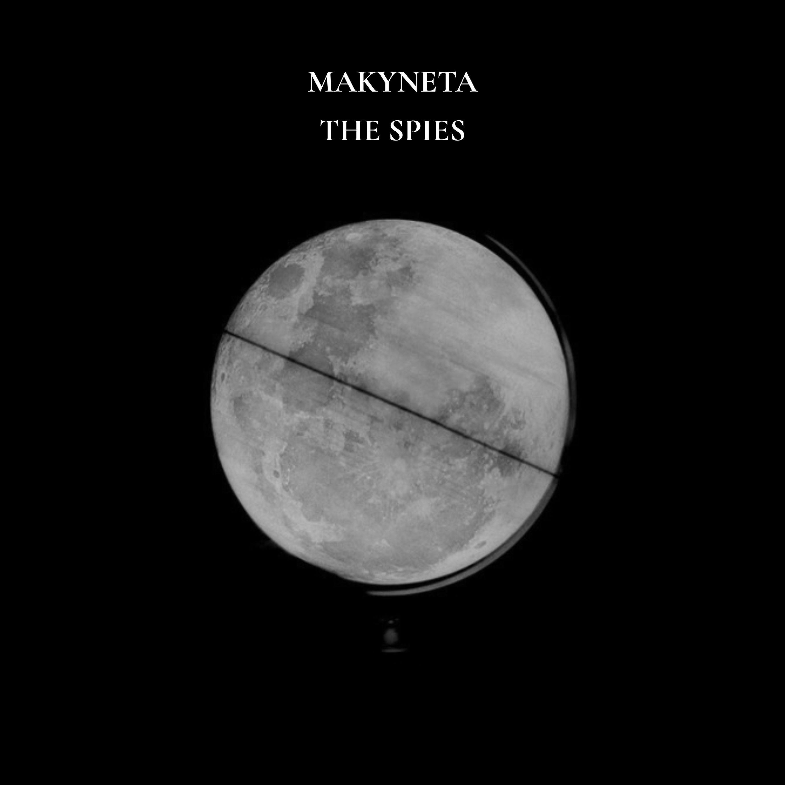

# 🎵 The Spies — Landing Page & Portfólio

Este é o repositório da landing page da música **"The Spies"** do artista **MAKYNETA**, criada como parte do portfólio de um desenvolvedor fullstack. O projeto une arte e tecnologia, com foco em design moderno, responsividade e showcase técnico.

---

## 🖼️ Pré-visualização



---

## 🚀 Tecnologias utilizadas

- [Next.js 14+](https://nextjs.org/)
- [React](https://react.dev/)
- [Tailwind CSS](https://tailwindcss.com/)
- [Shadcn UI](https://ui.shadcn.dev/)
- [Lucide Icons](https://lucide.dev/icons)

---

## 📁 Estrutura

```
/app/the-spies/         → Página principal da música
/components/ui/         → Componentes reutilizáveis (Button, Card)
public/
  ├── TheSpies.jpg      → Capa da música
  └── TheSpies.mp3      → Faixa de áudio
```

---

## 📦 Como rodar localmente

1. Clone o repositório:
   ```bash
   git clone https://github.com/seuusuario/the-spies-landing.git
   cd the-spies-landing
   ```

2. Instale as dependências:
   ```bash
   npm install
   # ou
   yarn install
   ```

3. Adicione os arquivos:
   - `TheSpies.jpg` → em `public/`
   - `TheSpies.mp3` → em `public/`

4. Rode o projeto:
   ```bash
   npm run dev
   # ou
   yarn dev
   ```

5. Acesse:
   ```
   http://localhost:3000/the-spies
   ```

---

## 📋 Funcionalidades

- Player de áudio com botão de play/pausa
- Letra completa da música embutida
- Seção "Sobre mim" como desenvolvedor fullstack
- Componentes reutilizáveis (`Button`, `Card`) para demonstrar organização e reutilização de código
- Mobile-first e responsivo

---

## 📮 Contato

Caso queira falar comigo sobre o projeto ou trabalho:

- Email: `seuemail@example.com`
- GitHub: [github.com/seuusuario](https://github.com/seuusuario)
- LinkedIn: [linkedin.com/in/seuusuario](https://linkedin.com/in/seuusuario)

---

## 📄 Licença

Este projeto é de uso pessoal/demonstrativo. Entre em contato para qualquer uso comercial da música "The Spies".
